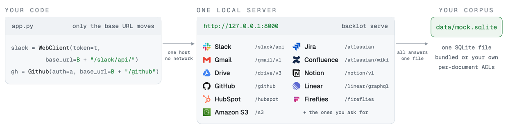

# Backlot

[](https://github.com/brekkylab/backlot/actions/workflows/ci.yml) [](https://pypi.org/project/backlot/) [](LICENSE) [](https://discord.gg/XCSsxYH6R) [](https://x.com/brekkylab)

**Serve your own enterprise playground**

Backlot is a local emulator for enterprise SaaS APIs. Test your Slack, Gmail, Google Drive and the rest of your integrations.

**No account. No token. No network.**


Why would you need that? Because right now:

- **You can't log in yet**. So you create a workspace, register an app, pick OAuth scopes and wait on an admin who has never heard of you. Zero API calls so far.
- **Then you do it again**. Gmail. Jira. Google Drive. Every source starts over from nothing.
- **So you mock it, and the test passes**. It passes because you wrote both sides of it. It always passes.

Backlot is the side you didn't write. It behaves exactly like the real one.

## Quickstart

```bash
pip install backlot
backlot import --bundled   # a corpus ships with the package; nothing to fetch or write
backlot serve              # http://127.0.0.1:8000
```

Or run one programmatically on a free port:

```python
import backlot
from slack_sdk import WebClient                        # pip install slack_sdk

with backlot.serve() as s:                             # no arguments: a tiny hello-world corpus
    slack = WebClient(token=s.token, base_url=f"{s.base_url}/slack/api/")
    print(slack.conversations_list()["channels"])
```

The only change from talking to the live service is the base URL.

## What it serves

Every source on one local port, each behind the path prefix its own SDK expects.

<picture><source media="(prefers-color-scheme: dark)" srcset="assets/figures/architecture.png"></picture>

Each row links a runnable example that drives that service the way the vendor documents it, using the official SDK where one exists.

| Service | Base path | Example |
|---|---|---|
| Slack | `/slack/api` | [`slack.py`](examples/using-official-sdk/slack.py) |
| Gmail | `/gmail/v1` | [`gmail.py`](examples/using-official-sdk/gmail.py) |
| Google Drive (Docs, Sheets, Slides) | `/drive/v3` `/docs/v1` `/sheets/v4` `/slides/v1` | [`gdrive.py`](examples/using-official-sdk/gdrive.py) |
| GitHub | `/github` | [`github.py`](examples/using-official-sdk/github.py) |
| Jira | `/atlassian/rest/api` | [`jira.py`](examples/using-official-sdk/jira.py) |
| Confluence | `/atlassian/wiki/rest/api` | [`confluence.py`](examples/using-official-sdk/confluence.py) |
| Notion | `/notion/v1` | [`notion.py`](examples/using-official-sdk/notion.py) |
| Linear | `/linear/graphql` | [`linear/`](examples/using-official-sdk/linear/) |
| HubSpot | `/hubspot` | [`hubspot.py`](examples/using-official-sdk/hubspot.py) |
| Fireflies | `/fireflies/graphql` | [`fireflies.py`](examples/using-official-sdk/fireflies.py) |
| Amazon S3 | `/s3` | [`s3.py`](examples/using-official-sdk/s3.py) |

The roadmap lives in [the tracking issue](https://github.com/brekkylab/backlot/issues/89) — ask there for the source you need.

## When you need this

- 🔌 **Building or upgrading an integration**. The cursors, page shapes and error bodies the real API returns, without an account to get them from.
- 🧪 **Testing it, and keeping it tested**. One fixture on your laptop and in CI, with no secrets and nothing to flake. Every user in the corpus gets a token, so you can also assert that one caller's documents never reach another.
- 🛠️ **Building before you have credentials**. A Slack-shaped, Google Drive-shaped world to develop against before anyone hands you production credentials.
- 🤖 **Evaluating a RAG pipeline or an agent**. The same corpus, the same ids and the same answers on every run, so a score that moves means your code moved.
- 🐛 **Reproducing a bug in data you can't see**. A document inside someone else's workspace breaks your parser. Write one shaped like it, serve it, and keep the failing test.

## Examples

| Point this at it | Runnable |
|---|---|
| 📦 Official vendor SDKs, one script per service | [`examples/using-official-sdk/`](examples/using-official-sdk/) |
| 🔗 MCP servers, or Backlot's own OpenAPI→MCP and GraphQL→MCP bridges | [`examples/using-mcp-with-agents/`](examples/using-mcp-with-agents/) |
| 🦙 Load it as documents, with the official [LlamaIndex](https://docs.llamaindex.ai/en/stable/module_guides/loading/connector/) readers | [`examples/using-llamaindex-readers/`](examples/using-llamaindex-readers/) |
| 🐍 Read it with `pandas`, `pyarrow` or `dask`, over an [fsspec](https://filesystem-spec.readthedocs.io/) filesystem | [`examples/using-fsspec/`](examples/using-fsspec/) |
| 🗂️ Read it with `ls`, `cat` and `grep`, over [mirage](https://github.com/strukto-ai/mirage)'s virtual filesystem | [`examples/using-mirage/`](examples/using-mirage/) |
| 📥 Your own corpus, from a JSONL file | [`examples/bring-your-own-corpus/`](examples/bring-your-own-corpus/) |

## Documentation

| | |
|---|---|
| Every source Backlot serves, and every endpoint of each | [docs/supported-sources.md](docs/supported-sources.md) |
| Building a corpus, and public datasets | [docs/corpus.md](docs/corpus.md) |
| Auth schemes and tokens | [docs/auth.md](docs/auth.md) |
| Measuring Backlot against the real APIs | [docs/fidelity.md](docs/fidelity.md) |
| Every `BACKLOT_*` setting | [docs/configuration.md](docs/configuration.md) |
| Vendor names and trademarks | [NOTICE.md](NOTICE.md) |

## Contributing

See [CONTRIBUTING.md](CONTRIBUTING.md). Fidelity to the real APIs is the point, so a divergence is a bug — measure against the real service, and bring a test that fails without your fix.

## License

[MIT](LICENSE)
